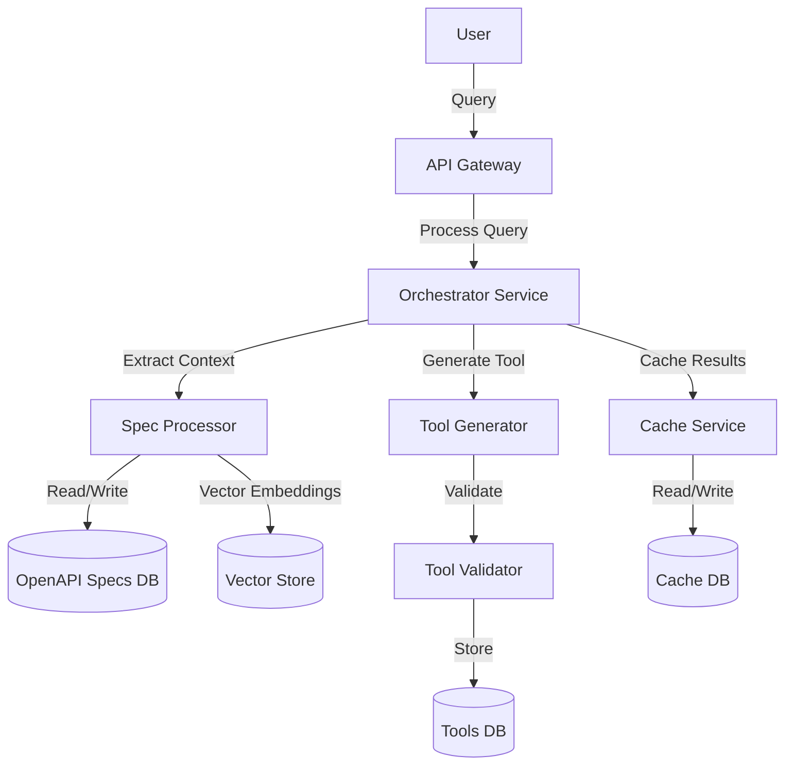

# Design Document: API Tool Generator

## Overview

The API Tool Generator is a system designed to automatically create production-ready tools based on external API specifications. It processes OpenAPI specifications, handles user queries, identifies relevant API endpoints, generates code, validates the generated tools, and stores them for future use. The system employs a combination of large language models (LLMs), vector databases, and traditional databases to achieve its goals.

This design document outlines the architecture, components, data models, and other aspects of the system to guide its implementation.

## Architecture

The API Tool Generator follows a microservices architecture with the following high-level components:



### Key Components:

1. **API Gateway**: Entry point for user queries, handles authentication and request routing.

2. **Orchestrator Service**: Coordinates the overall process, including the Master LLM that analyzes queries and orchestrates the tool generation workflow.

3. **Spec Processor**: Handles ingestion, chunking, and storage of OpenAPI specifications.

4. **Tool Generator**: Creates code for tools based on the query and relevant API endpoints.

5. **Tool Validator**: Tests generated tools against API specifications or mocks.

6. **Cache Service**: Manages caching of frequently used data and results.

7. **Databases**:
   - OpenAPI Specs DB: Stores processed API specifications
   - Tools DB: Stores generated and validated tools
   - Cache DB: Stores cached data and results

## Components and Interfaces

### 1. API Gateway

**Responsibilities:**
- Accept user queries
- Authenticate requests
- Route requests to appropriate services
- Return responses to users

**Interfaces:**


### 2. Orchestrator Service

**Responsibilities:**
- Analyze user queries using the Master LLM
- Coordinate the tool generation workflow
- Handle error recovery and retries
- Manage the overall process state

### 3. Spec Processor

**Responsibilities:**
- Ingest OpenAPI specifications
- Chunk large specifications
- Create embeddings for semantic search
- Store and index specifications
- Retrieve relevant API documentation based on queries


### 4. Tool Generator

**Responsibilities:**
- Generate code for tools based on queries and API endpoints
- Ensure code follows best practices
- Handle different programming languages and frameworks
- Create clean, production-ready code


### 5. Tool Validator

**Responsibilities:**
- Create test cases for generated tools
- Execute tests against mock or real APIs
- Analyze test results
- Provide feedback for tool regeneration


### 6. Cache Service

**Responsibilities:**
- Cache frequently used data and results
- Implement cache invalidation strategies
- Handle cache misses
- Optimize cache performance


## Data Models

### 1. OpenAPI Specification


### 2. Generated Tool

```typescript
interface ToolModel {
  id: string;
  name: string;
  description: string;
  query: string;
  apiProvider: string;
  language: string;
  framework?: string;
  code: string;
  endpoints: string[];
  createdAt: Date;
  updatedAt: Date;
  version: number;
  status: 'draft' | 'validated' | 'failed';
  validationResults?: ValidationResultModel;
  metadata: Record<string, any>;
}

interface ValidationResultModel {
  toolId: string;
  passed: boolean;
  testResults: TestResultModel[];
  errors: ValidationErrorModel[];
  timestamp: Date;
}
```

### 3. Cache Entry

```typescript
interface CacheEntry {
  key: string;
  value: any;
  createdAt: Date;
  expiresAt: Date;
  metadata?: Record<string, any>;
}
```

## Error Handling

The system implements a comprehensive error handling strategy:

1. **Validation Errors**: Errors related to invalid inputs or API constraints.
   - Handled by providing clear feedback to users and suggesting corrections.

2. **Processing Errors**: Errors that occur during the processing of API specifications.
   - Logged for analysis and reported to administrators.
   - Partial results may be used if available.

3. **Generation Errors**: Errors that occur during tool generation.
   - Analyzed by the Master LLM to adjust the generation approach.
   - May trigger regeneration with modified parameters.

4. **Validation Failures**: Errors that occur during tool validation.
   - Detailed error information is provided to the Tool Generator for correction.
   - Users are notified of validation issues with explanations.

5. **System Errors**: Infrastructure or dependency failures.
   - Implement circuit breakers and fallback mechanisms.
   - Provide appropriate error responses with retry information.

Error responses follow a consistent format:

```typescript
interface ErrorResponse {
  code: string;
  message: string;
  details?: any;
  timestamp: string;
  requestId: string;
  suggestions?: string[];
}
```

## Testing Strategy

The testing strategy for the API Tool Generator includes:

1. **Unit Testing**:
   - Test individual components and services in isolation.
   - Mock dependencies to focus on component behavior.
   - Achieve high code coverage for critical components.

2. **Integration Testing**:
   - Test interactions between components.
   - Verify database operations and service communications.
   - Use containerized testing environments.

3. **System Testing**:
   - End-to-end tests for complete workflows.
   - Test with real or realistic mock API specifications.
   - Verify tool generation, validation, and storage.

4. **Performance Testing**:
   - Measure response times for different query complexities.
   - Test system behavior under load.
   - Verify caching effectiveness.

5. **Chaos Testing**:
   - Simulate failures in different components.
   - Verify system resilience and recovery.

6. **Continuous Testing**:
   - Automated tests as part of CI/CD pipeline.
   - Regular regression testing.

## Additional Considerations

### Chunking Strategy for OpenAPI Specifications

The system will implement a structured approach to parsing and chunking OpenAPI specifications, addressing their potentially unstructured nature:

1. **JSON/YAML Parsing and Normalization**:
   - Use OpenAPI parser libraries (like Swagger Parser) to validate and normalize specifications.
   - Convert all specifications to a consistent internal representation regardless of original format.
   - Handle different OpenAPI versions (2.0, 3.0, 3.1) through version-specific adapters.

2. **Structure-Aware Chunking**:
   - Parse the OpenAPI specification as a structured document rather than plain text.
   - Maintain the hierarchical relationships between elements (paths, operations, schemas).
   - Create chunks based on the specification's natural boundaries:
     - Group by resource/endpoint paths
     - Group by tags defined in the specification
     - Group related schemas and their references
     - Preserve parent-child relationships between operations and their parameters/responses

3. **Reference Resolution**:
   - Resolve all `$ref` references before chunking to ensure complete context.
   - Track cross-references between chunks to maintain relationships.
   - Include necessary context when a chunk references elements in another chunk.

4. **Metadata Extraction**:
   - Extract structured metadata from each chunk (paths, operations, parameters, etc.).
   - Create a searchable index of this metadata for quick retrieval.
   - Use this metadata to filter and prioritize chunks during retrieval.

5. **Vector Embeddings**:
   - Generate embeddings for each chunk to enable semantic search.
   - Create separate embeddings for different aspects (descriptions, examples, parameter names).
   - Store embeddings in a vector database for efficient similarity search.
   - Update embeddings when specifications change.

6. **Hybrid Retrieval System**:
   - Combine structured metadata search with vector similarity search.
   - Use metadata to filter candidate chunks and vector search for ranking.
   - Implement a scoring system that considers both structural relevance and semantic similarity.

### Caching Strategy

The system implements a comprehensive multi-level caching strategy using CosmosDB with specific optimizations:

1. **Query Result Caching**:
   - Cache results for similar queries using semantic similarity matching.
   - Implement TTL-based expiration with configurable timeframes based on query complexity.
   - Invalidate cache when API specifications change using a versioning system.
   - Store query fingerprints to quickly identify similar queries.

2. **API Context Caching**:
   - Cache frequently accessed API endpoints and their details in a dedicated CosmosDB container.
   - Implement a distributed LRU eviction policy with CosmosDB's TTL feature.
   - Preload cache with popular endpoints based on usage analytics.
   - Use CosmosDB's change feed to propagate cache updates across services.

3. **Tool Generation Caching**:
   - Cache intermediate results during tool generation in a separate CosmosDB container.
   - Implement a component-based caching system to reuse code fragments across similar tools.
   - Use versioning to handle API changes with automatic invalidation.
   - Store generated code templates with parameterization for quick customization.

4. **Distributed Cache Implementation**:
   - Use CosmosDB's multi-region capabilities for globally distributed caching.
   - Implement local in-memory caches (using Redis) for ultra-high-frequency access patterns.
   - Create a cache hierarchy with tiered expiration policies.
   - Implement cache warming strategies for predictable workloads.

5. **Cache Consistency Management**:
   - Use optimistic concurrency control for cache updates.
   - Implement a pub/sub mechanism for cache invalidation events.
   - Track dependencies between cached items for cascading invalidation.
   - Use write-through caching for critical data paths.

### Security Considerations

1. **Authentication and Authorization**:
   - Secure API access with appropriate authentication mechanisms.
   - Implement role-based access control for administrative functions.
   - Protect sensitive API credentials.

2. **Data Protection**:
   - Encrypt sensitive data at rest and in transit.
   - Implement proper key management.
   - Follow data protection regulations.

3. **Input Validation**:
   - Validate all user inputs.
   - Sanitize inputs to prevent injection attacks.
   - Implement rate limiting to prevent abuse.

4. **Dependency Security**:
   - Regularly update dependencies.
   - Scan for vulnerabilities.
   - Follow security best practices for third-party libraries.

### Scalability Considerations

1. **Horizontal Scaling**:
   - Design stateless services that can scale horizontally.
   - Use container orchestration for dynamic scaling.
   - Implement load balancing across service instances.

2. **Database Scaling**:
   - Use CosmosDB's partitioning capabilities.
   - Implement efficient query patterns.
   - Consider read replicas for high-read scenarios.

3. **Processing Optimization**:
   - Parallelize processing where possible.
   - Implement batch processing for large specifications.
   - Use asynchronous processing for long-running tasks.

4. **Resource Management**:
   - Monitor resource usage.
   - Implement auto-scaling based on load.
   - Optimize resource allocation.### LLM
 Integration Strategy

The system strategically employs different types of LLMs for specific tasks throughout the workflow:

1. **Master Orchestrator LLM**:
   - **Type**: Large context window model (Gemini 2.5 Pro)
   - **Usage Points**:
     - Analyzing user queries to understand intent
     - Extracting relevant context from API documentation
     - Creating prompts for the code generator
     - Analyzing validation errors and adjusting generation strategy
   - **Characteristics**:
     - Optimized for reasoning and planning
     - Capable of handling large context windows (100K+ tokens)
     - Fine-tuned for API understanding and tool design
     - Runs with high temperature for creative problem-solving

2. **Specification Processing LLM**:
   - **Type**: Medium-sized model with strong structured data capabilities (Claude 3.7 Sonnet)
   - **Usage Points**:
     - Extracting structured information from API documentation
     - Generating metadata for chunks
     - Creating summaries of API capabilities
     - Identifying constraints and requirements
   - **Characteristics**:
     - Optimized for structured extraction
     - Fine-tuned on OpenAPI specifications
     - Runs with low temperature for consistent outputs
     - Specialized in technical documentation understanding

3. **Code Generation LLM**:
   - **Type**: Code-specialized model (Claude 4 Opus)
   - **Usage Points**:
     - Generating tool code based on prompts from the Master LLM
     - Refining code based on validation feedback
     - Creating test cases for validation
   - **Characteristics**:
     - Optimized for code generation
     - Fine-tuned on API client libraries
     - Specialized in multiple programming languages
     - Runs with medium temperature for balanced creativity and correctness

4. **Validation Analysis LLM**:
   - **Type**: Medium-sized model with strong reasoning capabilities (GPT 4.1)
   - **Usage Points**:
     - Analyzing test failures
     - Generating detailed error explanations
     - Suggesting fixes for validation issues
   - **Characteristics**:
     - Optimized for error analysis
     - Fine-tuned on common API integration errors
     - Runs with low temperature for precise analysis

5. **Embedding Models**:
   - **Type**: Specialized embedding models (OpenAI's text-embedding-ada-002)
   - **Usage Points**:
     - Creating vector embeddings for API specification chunks
     - Generating query embeddings for similarity search
     - Creating embeddings for generated tools for similarity matching
   - **Characteristics**:
     - Optimized for semantic similarity
     - Domain-adapted for technical documentation
     - High-dimensional embeddings for precise matching

### LLM Optimization Strategies

1. **Prompt Engineering**:
   - Develop specialized prompts for each LLM role
   - Implement prompt templates with clear instructions
   - Use few-shot examples for complex tasks
   - Maintain a prompt library with version control

2. **Context Management**:
   - Implement smart chunking to fit within context windows
   - Prioritize most relevant information in context
   - Use recursive summarization for large documents
   - Maintain context across multiple LLM calls

3. **Inference Optimization**:
   - Implement batching for similar requests
   - Use quantization for deployment efficiency
   - Optimize token usage through careful prompt design
   - Implement caching for common LLM outputs