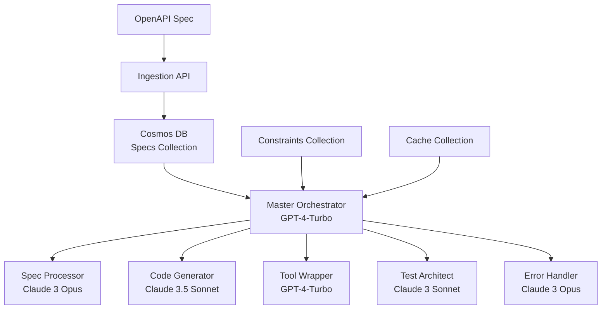

# Debales Tool Generator

A production-ready system for automatically generating LangChain tools from OpenAPI specifications using Azure services and multiple LLM models.

## Architecture

The Debales Tool Generator uses a multi-agent architecture with specialized LLM models for different tasks:



## Cosmos DB Collections

The system uses the following collections in Azure Cosmos DB:

1. **specs** - Stores raw API specifications
2. **chunks** - Stores individual endpoints from specs
3. **code_artifacts** - Stores generated code and tools
4. **constraints** - Stores API constraints and rules
5. **cache** - Caches intermediate results

## Installation

```bash
pip install -r requirements.txt
```

## Configuration

Create a `.env` file in the project root with the following variables:

```
# Azure Cosmos DB
COSMOS_ENDPOINT=your_cosmos_endpoint
COSMOS_KEY=your_cosmos_key
DEBALES_DATABASE_NAME=debales_tools

# Azure OpenAI
AZURE_OPENAI_API_KEY=your_azure_openai_key
AZURE_OPENAI_ENDPOINT=your_azure_openai_endpoint
AZURE_OPENAI_API_VERSION=2024-02-01
AZURE_OPENAI_CHAT_DEPLOYMENT_NAME=your_gpt_deployment_name
AZURE_OPENAI_EMBEDDINGS_DEPLOYMENT=your_embeddings_deployment_name

# Anthropic
ANTHROPIC_API_KEY=your_anthropic_key
```

## Usage

### Basic Usage

```python
from debales_tool_generator import DebalesToolGenerator

# Initialize the tool generator
generator = DebalesToolGenerator()

# Generate tools from an OpenAPI spec
with open("openapi_spec.json", "r") as f:
    spec_content = f.read()

# Generate LangChain tools
tools = generator.generate_tools(
    spec_content=spec_content,
    company_id="your_company_id"
)

# Use the tools in a LangChain agent
from langchain.agents import AgentExecutor, create_tool_calling_agent
from langchain_openai import AzureChatOpenAI
import os

model = AzureChatOpenAI(
    openai_api_version=os.environ["AZURE_OPENAI_API_VERSION"],
    azure_deployment=os.environ["AZURE_OPENAI_CHAT_DEPLOYMENT_NAME"],
)

agent = create_tool_calling_agent(model, tools, prompt)
agent_executor = AgentExecutor(agent=agent, tools=tools)

# Run the agent
result = agent_executor.invoke({"input": "Use the API to..."})
```

### Advanced Usage

#### Custom Prompts

You can customize the prompts used by each LLM:

```python
tools = generator.generate_tools(
    spec_content=spec_content,
    company_id="your_company_id",
    custom_prompt="Generate Python tools with async support and detailed error handling."
)
```

#### Working with Constraints

```python
# Add a custom constraint
generator.add_constraint(
    spec_id="your_spec_id",
    constraint={
        "endpoint_pattern": "/users/{user_id}",
        "rule_type": "validation",
        "condition": "user_id must be a valid UUID",
        "error_message": "Invalid user ID format"
    }
)

# Get all constraints for a spec
constraints = generator.get_constraints("your_spec_id")
```

#### Getting Tool Code

```python
# Get the code for all generated tools
tool_code = generator.get_tool_code("your_spec_id")

# Print the code for a specific tool
print(tool_code["UserProfileTool"])
```

## Integration with Support Chatbot

The Debales Tool Generator integrates seamlessly with the existing Support Chatbot system:

```python
from debales_tool_generator import DebalesToolGenerator
from Support_chatbot.base_chatbot.function import Qna
from langchain.agents import AgentExecutor, create_tool_calling_agent
from langchain.prompts import ChatPromptTemplate

# Initialize the tool generator
generator = DebalesToolGenerator()

# Generate tools from an OpenAPI spec
tools = generator.generate_tools(
    spec_content=spec_content,
    company_id="your_company_id"
)

# Create a chatbot with the generated tools
def custom_chatbot_with_tools(question, session_id, bot_id, user_prompt, db, cache):
    # Get chat history and other setup
    chat_message_history = db.set_chat_history(session_id)
    
    # Create agent with the generated tools
    prompt = ChatPromptTemplate.from_messages([
        ("system", "You are a helpful assistant with access to external APIs."),
        ("human", "{input}"),
        ("placeholder", "{agent_scratchpad}")
    ])
    
    model = AzureChatOpenAI(
        openai_api_version=os.environ["AZURE_OPENAI_API_VERSION"],
        azure_deployment=os.environ["AZURE_OPENAI_CHAT_DEPLOYMENT_NAME"],
    )
    
    agent = create_tool_calling_agent(model, tools, prompt)
    agent_executor = AgentExecutor(agent=agent, tools=tools)
    
    # Run the agent
    result = agent_executor.invoke({"input": question})
    
    # Format the response
    response = {
        "response": result["output"],
        "leading_queries": ["What else would you like to know?", 
                           "Can I help with anything else?", 
                           "Do you need more information?"]
    }
    
    return response
```

## License

Copyright (c) 2024 Debales. All rights reserved. 